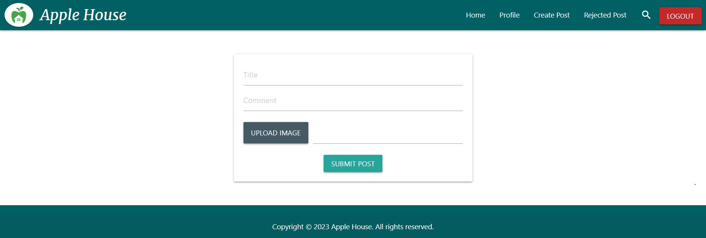

# Apple House Community Forum

Company “Apple House” launched a new product, and now they create a Forum for their users to ask questions related to the product.

## Features

+ As a guest user, can register himself/herself with an email and password so that he/she can login to the forum.
+ As a registered user, can login to the system with email and password so that user can access the forum.
+ As a user, can view all the approved posts on the forum.
+ As a user, can create a post so that it will be sent to admin approval.
+ As a user, can delete his/her own posts so that he/she can remove unwanted posts.
+ As a user, can comment on posts.
+ As a user, can search for a post using the search bar so that he/she can filter posts by matching text or the user.
+ As an admin user, can directly post without requiring approval.
+ As an admin user, can approve/ reject others' posts so that only admin approved posts will be posted.
+ As an admin user, can give feedback for any rejected post.
+ As an admin user, can filter posts by user and post created time.

## Installation

### Getting Started

+ Install NodeJS and the NPM package manager. (`$ npm install`)
+ Get your own MongoDB database. (you can get one for free at MongoDB Atlas or you can set up one locally)
+ Clone this project to your local machine `https://github.com/KalhariEkanayake/apple-house-project.git`
+ Redirect to `/server` and run `$ npx nodemon server` in terminal. The server will start on port 5001 and gets connected to mongoDB.
+ Now, in another terminal, redirect to `/client` and run `$ npm start`. It will start on port 3000 which is the client side of the application.

The page will reload when you make changes.
You may also see any lint errors in the console.

## User Interface Design

### Register Page

### Login Page

### Home Page

### Profile Page

### Create Post Page

### Check Post Page

### Rejected Post Page

### Admin Search Page

### Regular User Search Page

